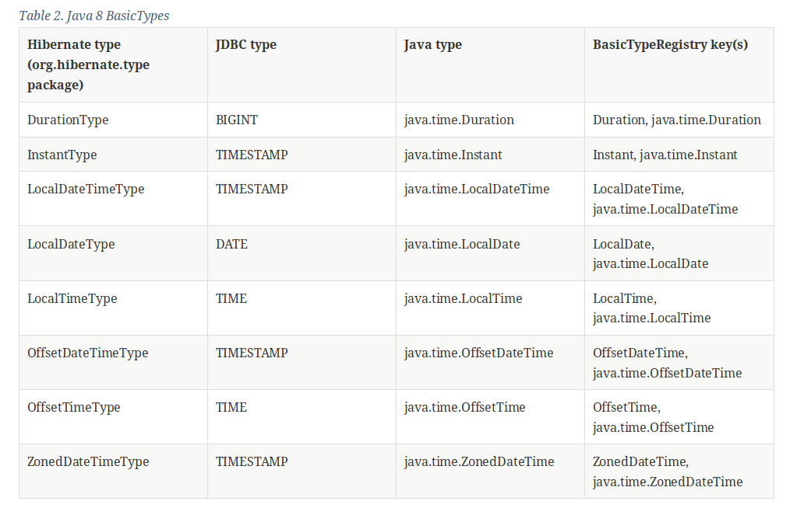

ifdef::env-github[]
:tip-caption: :bulb:
:note-caption: :information_source:
:important-caption: :heavy_exclamation_mark:
:caution-caption: :fire:
:warning-caption: :warning:
endif::[]
= Date and time

====
Using java.time:

1. Implement in Author his date of birth in DATE JDBC type.
2. Next implement date of adding Author to the database in TIMESTAMP JDBC type.
3. Implement date of issue in Book in DATE JDBC type.

_At the end check out your result in database._
====

IMPORTANT: SessionConnector - to run App, you need change imports of entities and set Connectors.

== Documentation

Checkout documentation:

* link:https://docs.jboss.org/hibernate/orm/5.2/userguide/html_single/Hibernate_User_Guide.html#basic-datetime[docs.jboss]
* link:https://docs.oracle.com/javase/7/docs/api/java/util/Calendar.html[java.util.Calendar]
* link:https://docs.oracle.com/javase/7/docs/api/java/util/Date.html[java.util.Date]
* link:https://docs.oracle.com/javase/8/docs/api/java/time/package-summary.html[java.time]
* link:https://docs.oracle.com/javase/8/docs/api/java/time/ZoneOffset.html[java.time.ZoneOffset]
* link:https://docs.oracle.com/javase/8/docs/api/java/time/OffsetTime.html[java.time.OffsetTime]

NOTE:

