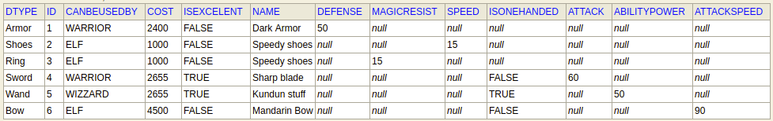
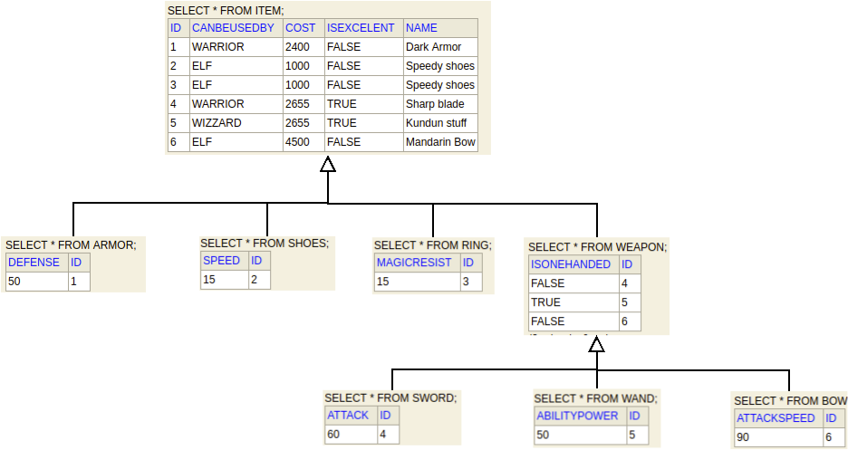
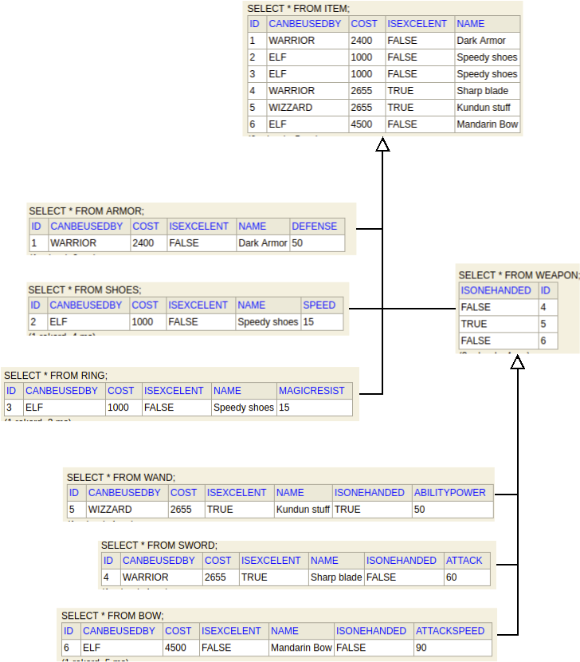
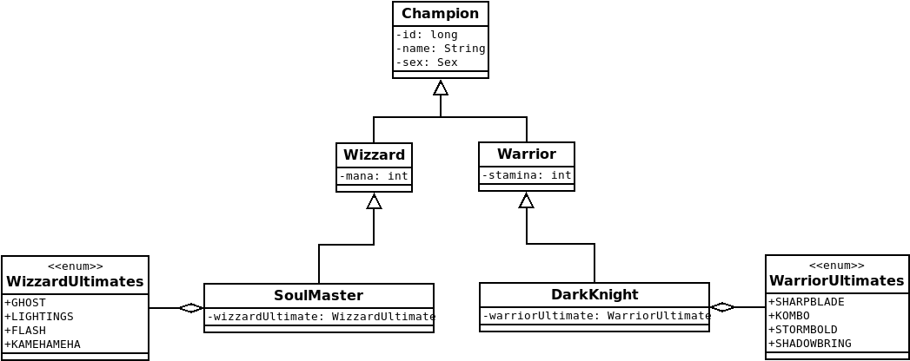

= INHERITANCE

== _Info_
Relation database __does not__ support inheritance known in java world.
Therefore  **J**ava **P**ersistence **A**PI defines three core strategies
helping convert class hierarchy into entities:
- Single Table - creates one table for each class hierarchy.
- Joined Table - each class in the hierarchy is mapped to its table.
- Table Per Class - table is defined for each concrete class in the inheritance hierarchy
to store all the attributes of that class and all of its superclasses.

``_You should read:_
link:https://en.wikibooks.org/wiki/Java_Persistence/Inheritance[wikibooks],
link:https://www.devglan.com/hibernate/hibernate-inheritance-example[devglan],
link:https://www.baeldung.com/hibernate-inheritance[baeldung]``

== _Examples_

Let's assume we have hierarchy as shown on the diagram below:

image::PNGs/ExampleOfHierarchy.png[]

then the presentations of the strategies in database gonna look like that:

single table strategy in database looks:

joined table strategy:

table per class:

== _Task_

So now you know (more or less) how inheritance strategies are converted into database.
Right below you have another simple class diagram. Your task is to implement all of the classes
(create another `model` package inside `inheritance` package) and put it into database using each of the strategy.

Check how each particular strategy is presented in the database.

Have fun.

_PS: you can use my wrapper in App menu to save entities into database. Remember to set proper driver configs
and add class marked as @entity in `SessionConnector` class._
