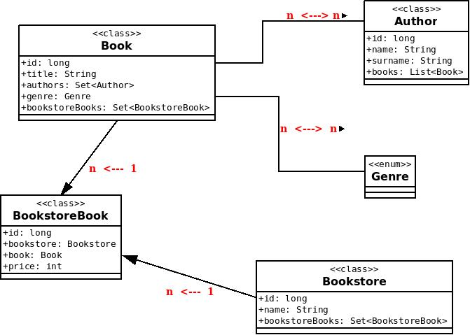

= Model creation

You've got a connection to the database. The next step is to create the needed tables.
In the picture, you can see how it should correspond to each other.
Try to implement these classes with given relations in the package `ja.workshops.hibernate.parts.model_implementation.model`.

-> When you finish, you could see a solution in the package `ja.workshops.hibernate.parts.model`.

== Documentation

Checkout documentation:

* link:https://docs.jboss.org/hibernate/orm/5.2/userguide/html_single/Hibernate_User_Guide.html#entity[docs.jboss/entity]
* link:https://docs.jboss.org/hibernate/orm/5.2/userguide/html_single/Hibernate_User_Guide.html#identifiers[docs.jboss/identifiers]
* link:https://docs.jboss.org/hibernate/orm/5.2/userguide/html_single/Hibernate_User_Guide.html#associations[docs.jboss/associations]
* link:https://docs.jboss.org/hibernate/orm/5.2/userguide/html_single/Hibernate_User_Guide.html#basic-enums[docs.jboss/basic-enums]